# Kids Memory Game 

You can view the deployed website [here](https://irissmok.github.io/Kids-Memory-Game-MS2/)

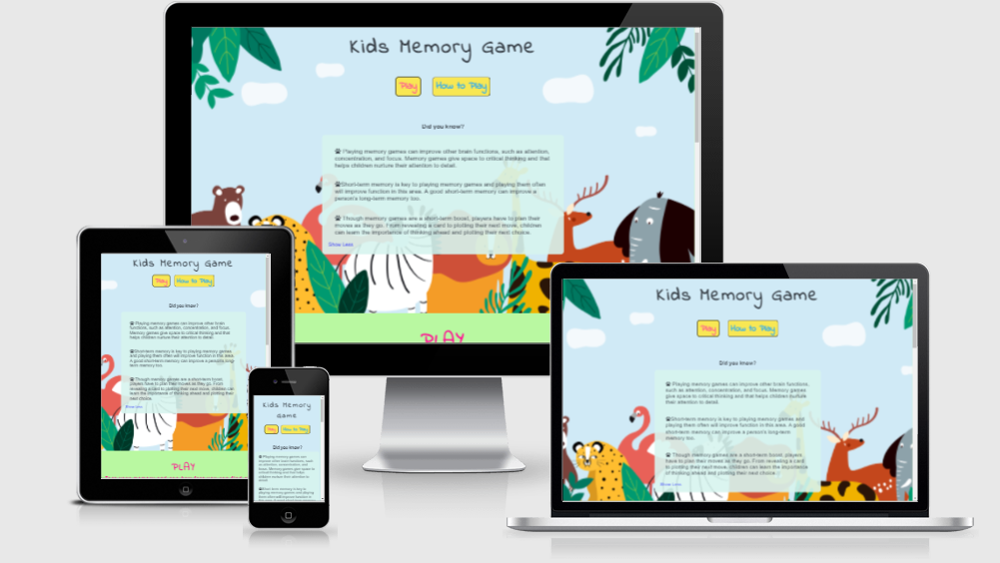

# UX
The inspiration for this game was my daughter. I wanted to make a game that would have a good impact on a child's brain. As a parent I know how hard it is to keep children away from the screen, but sometimes this is inevitable. So I wanted to make a game that would be useful and fun at the same time.
I did a little research on memory games and found out that playing memory games can improve other brain functions, such as attention, concentration, and focus. Memory games give space to critical thinking and that helps children nurture their attention to detail.  
This project is intended for children from 3 - 7 years.

## Users Stories 
As a parent:
- I want to make sure the content is applicable to children
- I want my child to easily understand the purpose of the game
- I want my child to have fun while developing memory

As a player:
- I want to have fun
- I want to see nice and colorful game
- I want to see nice pictures that will keep my attention 
- I want to see my time and moves
- I want to contact the developer for questions

#
# Scope 

## Features

- An simple and colorful page structure so that the user can easily find the game
- "Play" button - takes the user to the play section
- "How to play?" button - provides information about the game rules
- "Did you know" section - provides fun facts about the importance of memory game and their impact on children’s memory
- Memory board - contains 16 cards, the user must find a par for each card
- Number of moves and time - shows the user how many moves he has taken in how much time
- "Reset" button - user can reset the game and play again
- "Congratulations Window" - after the user finds all 16 cards, a congratulations window appears showing the moves and time the user has achieved
- Contact form - user can contact the game provider if he has questions or suggestions for the game
- Footer - contains mail address and social links

## Future features

- Add more levels to increase difficulty
- Add sound when user turns the card
- When form is submitted, send a confirmation email

#
# Structure

- **Title**  
    - located at the top of the page

- **Play Button**  
    - located below the title next to the "How to Play" button, takes the user to the game section

- **How to play Button**  
    - located below the title, next to the "Play" button, with a click a window opens that allows the user to read the rules of the game

-  **Did you know**  
    - located bellow buttons, contains fun facts about how memory game affects our memory and brain development 

-  **Play Section**  
    - contains the title and a brief introduction, after which the game begins. In the play section, there is a memory game board that contains 16 cards. The user must find a par for each card to win the game. 
    Moves and time - located below the game board, show the user how many moves have been used in how much time

-  **Contact Form**  
    - allows the user to contact the game provider if he has questions or suggestions for the game

 -  **Footer**     
    - contains mail address and social link

# Wireframes

## Desktop View

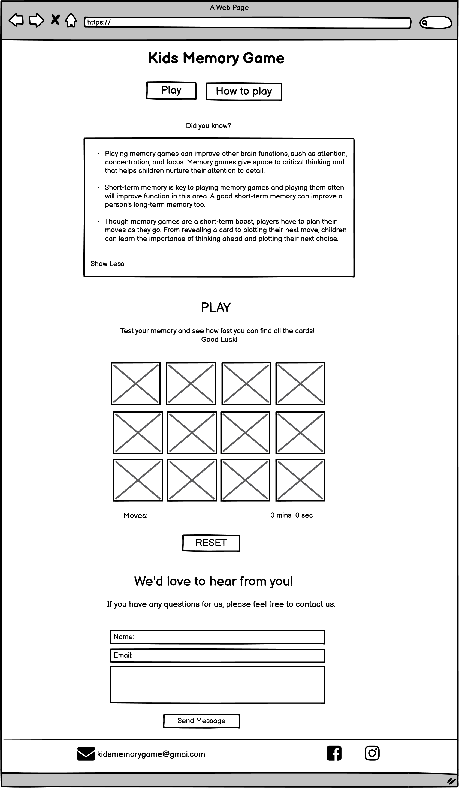

# Tablet view

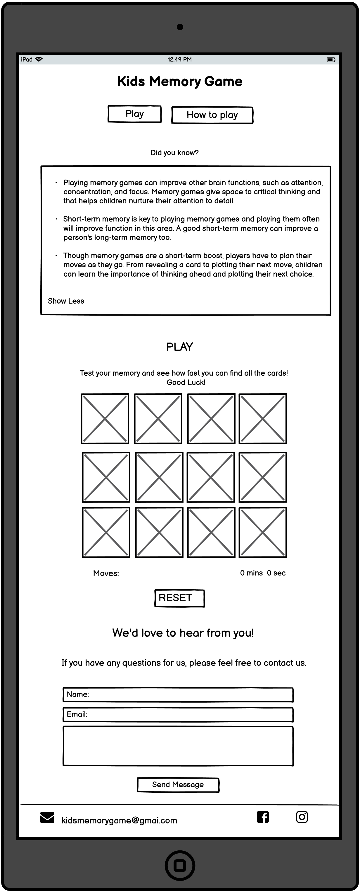

# Mobile View

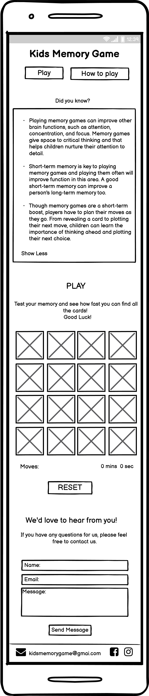

# Surface

# Design 
The design of this site is made in bright and cheerful colors because they make the page cheerful and the main goal of this page is fun and of course memory training. The site is intended for children from 3 to 7 years, so the site must be colorful and easy to navigate and understand.

It's one-page site with two parts.
The first part is  consists of the title, the short section "Did you know?", a button that opens the game rules, and a "Play" button that takes the user to the memory game section.
The second part is consists of the memory game section, contact form and a footer. The memory game section contains the Memory Game board under which the moves and time are located, the user can see their time and number of moves they used along the way. The user can push the reset button to reset the game and start again. 
When all the pairs are found the congratulations message pop up with final time and moves.

## Chosen Color 

Color palette from Coolors

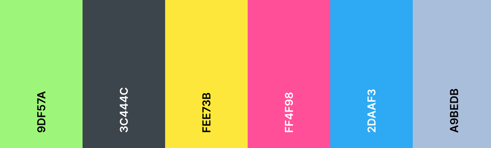

- **#9df57ab5** - body background color. It fits nicely with the background image. The site looks colorful and fun.
- **#3c444c** - the main color. I choose this color because it matches nicely with the rest of the page. The color is neither too dark nor too bright.
- **#fee73bde** - color for play, how to play and reset button. The color is cheerful. That’s why I liked it because it elevates the look of the page.
- **#ff4f98**- color for Play btn. Fits nicely with yellow background. 
- **#2daaf3** - color for How to play text on the button, Reset text and background of Submit.  The color goes well with yellow and pink and gives the page a cheerful look. 
- **deeppink** - color is used for brief introduction before the board game and title of the contact form. 
- **#a9bedb** - footer background color. I liked the color because it is neither too dark nor too bright. It fits nicely with the whole page and with a submit button.

## Font 
- Arial, sans-serif - main font
- Indie Flower - for headings and buttons

## Media

**Background Image** - covering the first part of the page. It is designed in cheerful colors to make the page cheerful and fun. The picture contains animals as well as the memory game itself. I choose this image because it's children friendly and everyone loves animals.

**Memory Game** - the images contain animals, each with a background of a different color which makes game fun and colorful. 

# Technologies Used

## Languages 
- [HTML5](https://en.wikipedia.org/wiki/HTML5)
- [CSS3](https://en.wikipedia.org/wiki/CSS)
- [JS](https://en.wikipedia.org/wiki/JavaScript)

## Frameworks, Libraries & Programs Used

- [Google Fonts](https://fonts.google.com/https://fonts.google.com/) - provide Indie Flower fonts for the website.

- [Github](https://github.com/IrisSmok) - was used to store the project code.

- [Gitpod](https://www.gitpod.io/) - was used for coding.

 - [Font Awesome](https://fontawesome.com/) -was used for the "Did you know?" list icons.

- [Balsamiq](https://balsamiq.com/) - was used to create site wireframes.

- [Am I Responsive](http://ami.responsivedesign.is/) - to check if the site is responsive on different screen sizes.

- [Tiny PNG](https://tinypng.com/) - this site is used to help me compress the images

- [Birme](https://www.birme.net/?target_width=150&target_height=150) - to help me resize the photos for memory board

- [Freepik](https://www.freepik.com/home) - was used for background image

- [Pixabay](https://pixabay.com/) - was used for all the images in the memory game

- [Beautify Tools](https://beautifytools.com/javascript-validator.php) - was used to validate JS

- [W3C Markup Validator](https://validator.w3.org/#validate_by_input) - was used to validate HTML

- [W3C CSS Validator](https://jigsaw.w3.org/css-validator/) - was used to validate CSS

- [Beautify](https://www.jpkc.com/tools/beautify/) - was used to correct indentation issues and get rid of too much whitespace - HTML, CSS and JS

- [Coolors](https://coolors.co/9df57a-3c444c-fee73b-ff4f98-2daaf3-a9bedb) - to make color palette

# Testing
- Tested on Chrome, Opera, Microsoft Edge, and Firefox desktop version browsers
- Chrome Developer Tools are used to test the responsiveness on: Desktop, Laptop, Moto G4, Galaxy S5, iPhone 5/SE, iPhone 6,7,8, iPhone 6,7,8 Plus, iPad, iPad Pro, Galaxy Fold
 
 Ensure that all user stories are achieved:

**For parents:** 
-  When entering the page, the parent can quickly and easily see the bright and nice color, images and content of the page. 
-  Clicking on the "How to play" button, the child can read game instructions that are clear and short.
-  The game is fun and challenging for kids. Cheerful images make it fun, while moves counter and timer make it challenging.

**For user:**
   - The game is fun for kids. Images of animals, cards that are shuffled each time a new game starts, moves counter and timer makes the game fun and challenging.
   - Memory game is designed in bright and colorful colors. Animals images cards with colorful backgrounds make the game nice.
   - The background image and cards images are bright and cheerful, easily capturing the user's attention
   - A move counter and timer are placed under the memory board so that the user can see the moves and time he made during the game. When users find all 16 matches, a congratulatory pop-up window with final time and moves appears.

I used Lighthouse tools to test my website

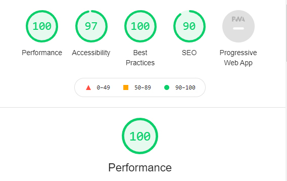

## Bugs and Issues

 - Play button was located inside the "a" tag, which threw a bug in the HTML Validator. I solved the problem by replacing the button tag with the span tag. 

- Warning: Family names containing whitespace should be quoted. If quoting is omitted, any whitespace characters before and after the name are ignored and any sequence of whitespace characters inside the name is converted to a single space.
warning was fixed by adding quotes to the Family names

- While playing a memory game I noticed that if you press the reset button you can't turn the cards over again, only after a few seconds. The problem was solved by adding the ResetBoard function to the startGame function which allows the memory board to reset

- I found an error some of the devices were not responsive, Galaxy Fold. I solved this problem by adding an extra media query - max-width 300px

# Final Product 

## Desktop View 
 

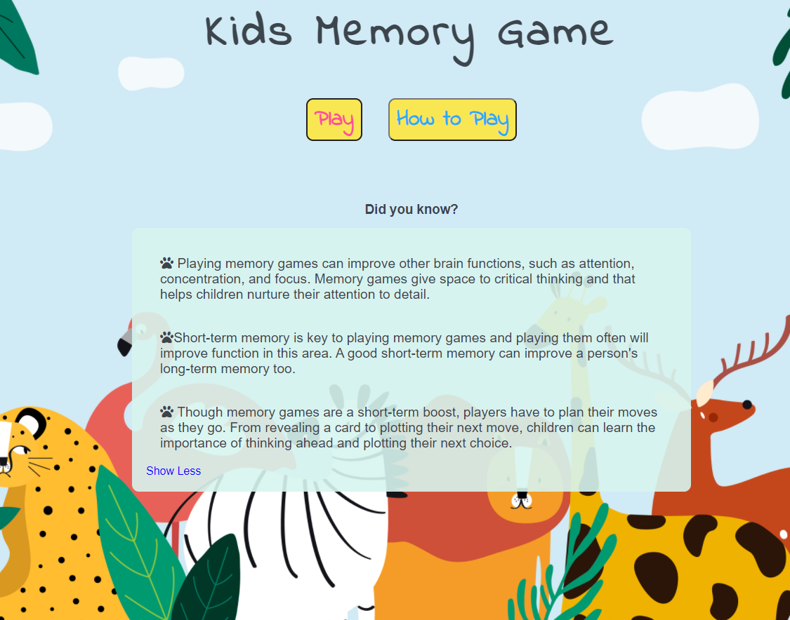

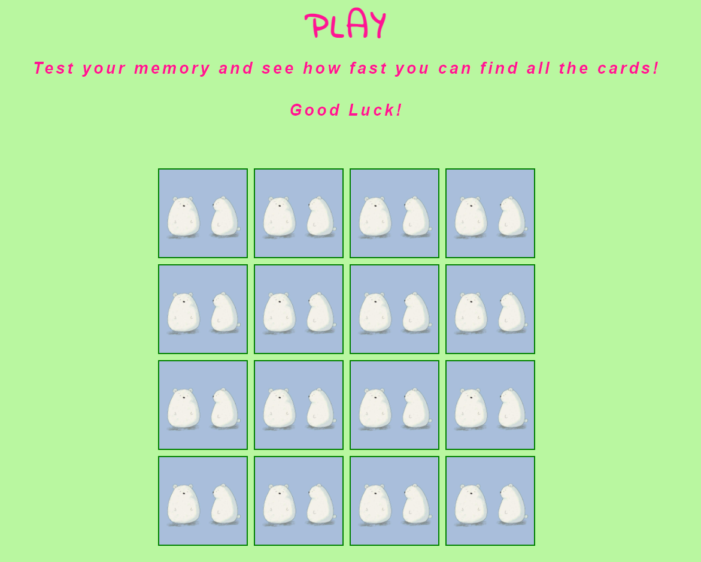

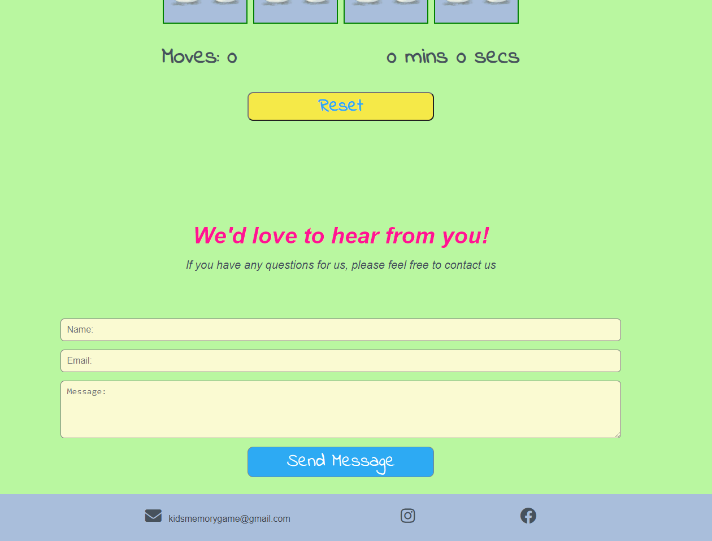

## Tablet View 
 
 

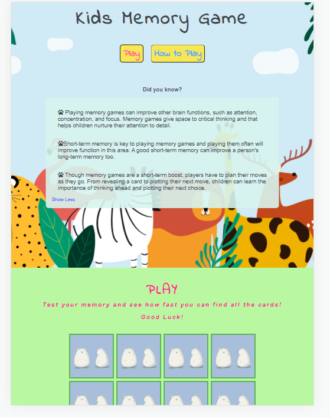

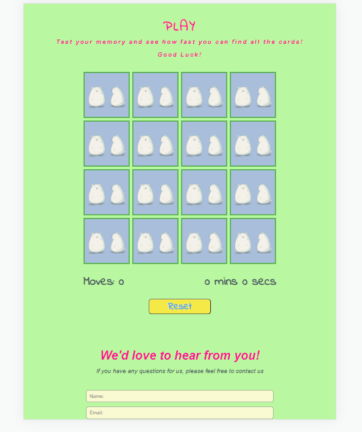

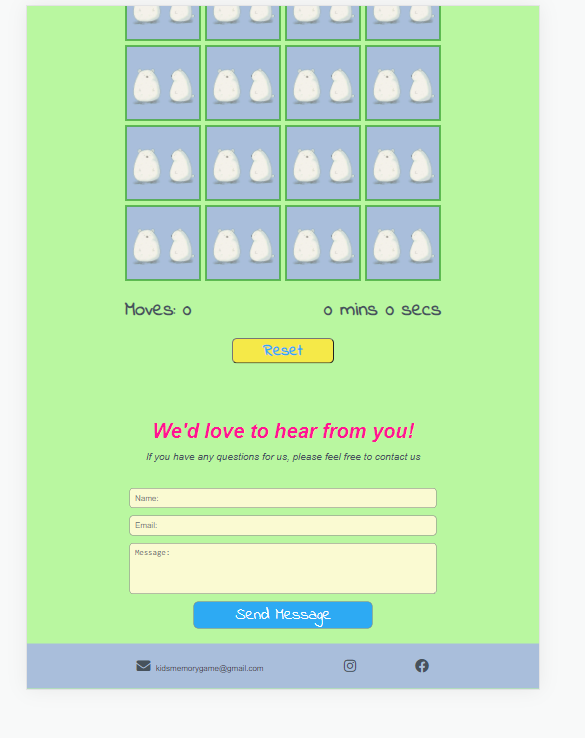

## Mobile View 
 
 

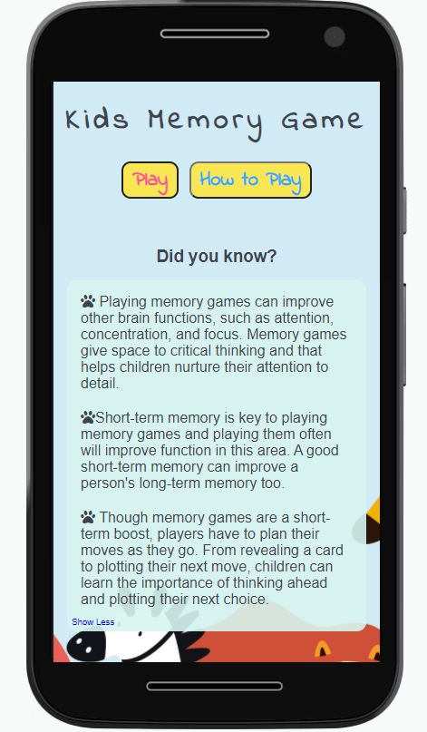

 

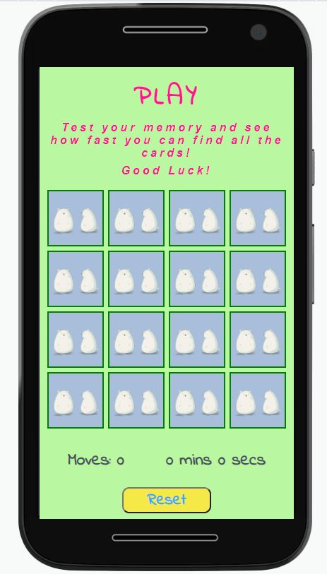

 

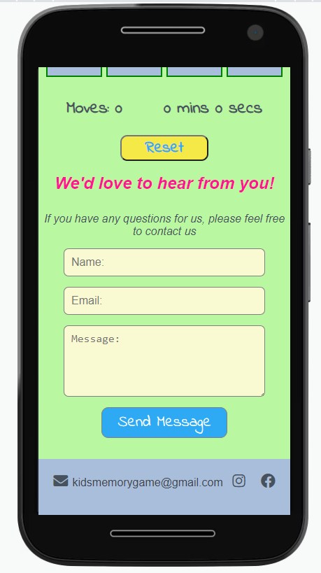

# Deployment

## GitHub Pages

1. Log into GitHub and locate the repository.
2. At the top locate the settings option.
3. Scroll towards  the bottom of the page and locate GitHub Pages.
4. Click on the link "Check it out here!".
4. Under 'Source' dropdown, click 'Master' from the options.
5. Click the save button.
6. The site is now published, it may not be available immediately. 
7. The site URL is visible on the green bar under the "Github Pages".

## To run locally 
 - Log into GitHub and select a repository to download.
 - Select code and Download the ZIP file.
 - Once the download is complete, you can extract the file and use it in your local environment.

# Credits

Memory Game:

- [Marina Ferreira](https://github.com/code-sketch/memory-game) - youtube
- [Web Dev](https://www.youtube.com/watch?v=bbb9dZotsOc) - youtube
- [Sandra Israel](https://scotch.io/tutorials/how-to-build-a-memory-matching-game-in-javascript) - for congratulations window, timer and moves 

## Media

[Freepik](https://www.freepik.com/home) - was used for background image

[Pixabay](https://pixabay.com/) - was used for all the images in the memory game

## Acknowledgements

- Thanks to my mentor for helpful feedback
- Slack community for answering all my questions 
- Big thanks to my husband Mislav for helping me test the website
- Friend for support and helpful feedback
